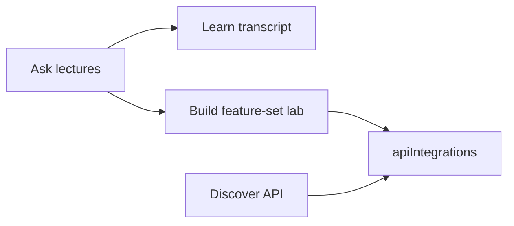

# aiEngineering-DataML-learningPack

Foundation for a **unified progressive-applied learning platform**: instructive modules and applied experiences for learners at every level—built on curated Data/ML resources, **Ask** over open Stanford lecture transcripts, and **Earth & Space feature sets** that use live APIs to demonstrate lecture principles.

This repository is the **content substrate**. Product UX lives in `platform/web`. See [docs/FRONTEND_EXPERIENCE.md](docs/FRONTEND_EXPERIENCE.md).

## Experience map

| Product area | User intent |
|--------------|-------------|
| **Ask** | PhD-style questions over Stanford lecture transcripts |
| **Learn** | Handbook lessons + Stanford lecture tracks (`TranscriptReader`) |
| **Build** | Practice scripts + **Earth & Space feature-set labs** (runtime-fetch) |
| **Discover** | Datasets/APIs—including EONET, TLE, Launch Library 2 |
| **Read** | Production ML case studies (coming soon) |
| **Progress** | Continue / What next |

## Stanford → live data loop

Lecture concepts are not only searchable—they become **applied** with real-time (or near-real-time) public APIs:

1. **Ask** a question grounded in CS229 / EE263 / EE364 / EE261 / CS106 / CS223A.
2. Open the **cited transcript** under Learn.
3. **Apply** → a lab on Build track `stanford-earth-space` (feature set matched to the course).
4. **Discover** API cards link to offline-friendly kits in [`docs/apiIntegrations/`](docs/apiIntegrations/).



Deep dive: [docs/STANFORD_EARTH_SPACE.md](docs/STANFORD_EARTH_SPACE.md).

## API integration kits

Local docs mirror the NASA EONET pattern (links + field docs + snapshots). Auth: **none** for these three.

| Kit | Folder | Data | Feature sets | In-app |
|-----|--------|------|----------------|--------|
| NASA EONET v3 | [docs/apiIntegrations/nasa/](docs/apiIntegrations/nasa/) | Open Earth events, GeoJSON, magnitudes, layers | FS1, FS4, FS5 | `/discover/kits/nasa` |
| TLE | [docs/apiIntegrations/tle/](docs/apiIntegrations/tle/) | Search, orbital elements, SGP4 propagate (+ velocity) | FS2, FS5 | `/discover/kits/tle` |
| Launch Library 2 | [docs/apiIntegrations/launch-library/](docs/apiIntegrations/launch-library/) | Statuses, agencies, pads, upcoming launches | FS3, FS5 | `/discover/kits/launch-library` |

Index: [docs/apiIntegrations/README.md](docs/apiIntegrations/README.md). Starter URLs live in each folder’s `*Links.md`. Tag filters: `/discover/apis?tag=eonet` (also `tle`, `launch-library`).

## Feature sets at a glance

Curated multi-concept labs under [`platform/labs/stanford-earth-space/`](platform/labs/stanford-earth-space/) (first-party—**does not mutate** `forks/`):

| Set | Principles | Lecture grouping | APIs |
|-----|------------|------------------|------|
| **FS1** Events & Labels | Features, labels, acquisition | CS229 + CS106 | EONET |
| **FS2** State & Tracking | State trajectories, tracking | EE263 + CS223A | TLE (+ EONET) |
| **FS3** Schedule & Constraints | Windows, ranking | EE364 + CS106 | Launch Library 2 |
| **FS4** Signals & Magnitudes | 1-D signals, event rate | EE261 + CS229 | EONET |
| **FS5** Capstone | Multi-source fusion | CS229 + EE263 + CS223A | All three |

Catalog: track `stanford-earth-space`, metadata [`data/catalog/feature-sets.json`](data/catalog/feature-sets.json) (loaded by the web app). Feature-set hubs: `/build/stanford-earth-space/sets/{setId}`.

## How to run

### Web app

```bash
cd platform/web
cp .env.example .env   # optional: OPENAI_API_KEY for Ask synthesis
npm install
npm run dev
```

Open [http://localhost:3000](http://localhost:3000):

| Area | Routes |
|------|--------|
| Ask | `/ask` |
| Learn | `/learn` (`python-ds`, `stanford-*`) |
| Build | `/build` (`python-practice`, `stanford-applied`, **`stanford-earth-space`**, `/sets/{setId}`) |
| Discover | `/discover` (APIs `?tag=`, kits `/discover/kits/{slug}`) |

### Earth & Space labs (network required)

```bash
cd platform/labs/stanford-earth-space
python3 -m venv .venv && source .venv/bin/activate
pip install -r requirements.txt
python fs1_events_labels/01_fetch_open_events.py
```

Outputs → `out/` (gitignored). Or use **LabLauncher** in the Build UI for copyable `cd` / `python` commands.

## Regenerate / refresh

| Asset | Command / action |
|-------|------------------|
| Stanford Ask index | `python3 platform/ingest/stanford/ingest.py` |
| apiIntegrations snapshots | Manual re-`curl` of `*Links.md` endpoints when schemas change (not request-path) |

Ask retrieval works offline from `data/ask/`; synthesis needs `OPENAI_API_KEY` in `platform/web/.env` (never commit).

## What this repo contains

Vendored snapshots under [`forks/`](forks/) (not submodules). Stanford transcripts: [`docs/stanfordLectureTranscripts/`](docs/stanfordLectureTranscripts/) (9 courses, 205 lectures). Overlay catalogs: [`data/catalog/`](data/catalog/). Ask FTS index: [`data/ask/`](data/ask/).

**Do not** rewrite forks or transcripts for product metadata—use overlays.

### Learning pillars

| Pillar | Path |
|--------|------|
| Fundamentals | [`forks/r4ds/`](forks/r4ds/), [`forks/PythonDataScienceHandbook/`](forks/PythonDataScienceHandbook/) |
| Data engineering | [`forks/data-engineering-zoomcamp/`](forks/data-engineering-zoomcamp/) |
| Production ML literacy | [`forks/applied-ml/`](forks/applied-ml/) |
| Hands-on practice | [`forks/Python-project-Scripts/`](forks/Python-project-Scripts/) |
| Discovery catalogs | [`forks/public-apis/`](forks/public-apis/), [`forks/awesome-public-datasets/`](forks/awesome-public-datasets/) |
| Stanford lectures | [`docs/stanfordLectureTranscripts/`](docs/stanfordLectureTranscripts/) |
| Live API kits | [`docs/apiIntegrations/`](docs/apiIntegrations/) |
| Earth–Space labs | [`platform/labs/stanford-earth-space/`](platform/labs/stanford-earth-space/) |

### Availability

| Availability | Meaning |
|--------------|---------|
| **Local** | Usable offline from the repo |
| **Link-only** | Index local; payload on the open web |
| **Runtime-fetch** | Labs/scripts fetch live data when run (Earth–Space labs, some zoomcamp labs) |

## Platform documentation

| Document | Purpose |
|----------|---------|
| [docs/STANFORD_EARTH_SPACE.md](docs/STANFORD_EARTH_SPACE.md) | Feature sets ↔ lectures ↔ APIs |
| [docs/ASK_CONVERSATIONAL_SEARCH.md](docs/ASK_CONVERSATIONAL_SEARCH.md) | Ask retrieval & synthesis |
| [docs/CONTENT_CATALOG.md](docs/CONTENT_CATALOG.md) | Catalog ontology |
| [docs/ARCHITECTURE.md](docs/ARCHITECTURE.md) | APIs & bounded contexts |
| [docs/FRONTEND_EXPERIENCE.md](docs/FRONTEND_EXPERIENCE.md) | UX source of truth |
| [docs/AGENT_BUILDOUT.md](docs/AGENT_BUILDOUT.md) | Parallel agent contracts |
| [platform/web/openapi.yaml](platform/web/openapi.yaml) | HTTP API contract |

## Included forks

| Path | Source |
|------|--------|
| [`forks/r4ds/`](forks/r4ds/) | [will-olson/r4ds](https://github.com/will-olson/r4ds) |
| [`forks/public-apis/`](forks/public-apis/) | [will-olson/public-apis](https://github.com/will-olson/public-apis) |
| [`forks/awesome-public-datasets/`](forks/awesome-public-datasets/) | [will-olson/awesome-public-datasets](https://github.com/will-olson/awesome-public-datasets) |
| [`forks/data-engineering-zoomcamp/`](forks/data-engineering-zoomcamp/) | [will-olson/data-engineering-zoomcamp](https://github.com/will-olson/data-engineering-zoomcamp) |
| [`forks/applied-ml/`](forks/applied-ml/) | [will-olson/applied-ml](https://github.com/will-olson/applied-ml) |
| [`forks/Python-project-Scripts/`](forks/Python-project-Scripts/) | [will-olson/Python-project-Scripts](https://github.com/will-olson/Python-project-Scripts) |
| [`forks/PythonDataScienceHandbook/`](forks/PythonDataScienceHandbook/) | [will-olson/PythonDataScienceHandbook](https://github.com/will-olson/PythonDataScienceHandbook) |
