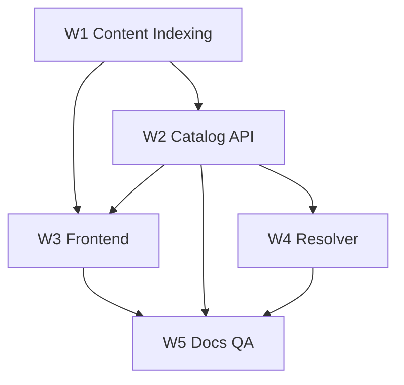

# Agent Buildout

Parallel agent orchestration contract for building the learning platform on this pack. Shared schemas: [CONTENT_CATALOG.md](CONTENT_CATALOG.md). APIs: [ARCHITECTURE.md](ARCHITECTURE.md). UX: [FRONTEND_EXPERIENCE.md](FRONTEND_EXPERIENCE.md).

## Guardrails (all agents)

- Do **not** rewrite or “clean up” content under `forks/` for product metadata.
- Do **not** commit secrets or third-party API keys.
- Prefer **overlay** catalog/progress under `data/catalog/` or `platform/`.
- Do not expose raw `forks/` browsing as the primary end-user navigation.
- Keep documentation and contracts in sync when APIs or schemas change.

## Workstreams

| ID | Workstream | Owns | Consumes |
|----|------------|------|----------|
| W1 | Content Indexing | Overlay tracks/modules JSON, fixtures | Forks (read-only), Content Catalog schema |
| W2 | Backend Catalog API | REST (or BFF) filters, resolve, progress, suggestions | Overlay JSON, Architecture API |
| W3 | Frontend Shell & Usability | Product areas, filters, suggestions UI, home | API or fixtures, Frontend Experience |
| W4 | Resource Resolver | External URL normalization, attribution helpers | Module `external_url` / availability |
| W5 | Docs / QA | Cross-doc consistency, DoD verification | All outputs |

## Ownership boundaries

- **W1** may add/update overlay files only; never patch fork sources to fix titles.
- **W2** does not implement visual chrome; returns stable JSON contracts.
- **W3** may stub API with fixtures until W2 lands; must match query param names from Architecture.
- **W4** does not scrape or download datasets in v1; resolves metadata and open targets.
- **W5** blocks merge of “done” claims that violate Frontend anti-patterns or schema drift.

## Parallelization matrix

| Phase | Parallel work |
|-------|----------------|
| P0 | W1 emits minimal `tracks.json` + `modules` fixtures (one module per track). W3 scaffolds shell + home against fixtures. W5 reviews docs. |
| P1 | W1 expands track spines. W2 implements `GET /tracks`, `GET /modules` with filters. W3 wires FilterBar + sticky chips. |
| P2 | W2 adds progress + `GET /suggestions`. W3 SuggestionRail + WhatNextPanel. W4 resolve endpoint. |
| P3 | Polish: search combobox, mobile filter sheet, accessibility pass, DoD checklist. |

Frontend **can and should** proceed in parallel with W2 using fixtures that match the catalog schema.

## Shared contracts

| Artifact | Producer | Consumer |
|----------|----------|----------|
| Module / track JSON schema | W1 (+ Content Catalog) | W2, W3 |
| OpenAPI or TS types for `/api/v1` | W2 | W3, W4 |
| Fixture catalog (`fixtures/*.json`) | W1 | W3 (stubs), W5 |
| Suggestion response shape | W2 / Architecture | W3 |
| UX checklist | Frontend Experience | W3, W5 |

## Definitions of done

### W1 Content Indexing

- [ ] At least one full spine per primary track (`python-ds`, `r-ds`, `de-zoomcamp`, `applied-ml-reading`, `python-practice`, `discover-data`)
- [ ] Records include `product_area`, `level`, `offline_ok`, `availability`, `next_ids` or track order
- [ ] Fixtures committed for FE stubs
- [ ] No writes under `forks/`

### W2 Backend Catalog API

- [ ] `GET /tracks`, `GET /modules` with documented filter query params
- [ ] `GET /modules/{id}`, `GET /suggestions` (max 3 + `reason`)
- [ ] Progress get/complete (even if file/session backed)
- [ ] OpenAPI or shared types published

### W3 Frontend Shell & Usability

- [ ] Responsive breakpoints verified (mobile + desktop)
- [ ] Filter/dropdown **keyboard** access
- [ ] Sticky filters per product area + removable chips
- [ ] SuggestionRail capped at 3 with rationale copy
- [ ] Product-area nav works **without** exposing `forks/` paths to end users
- [ ] Home matches single-composition rules (Frontend Experience §3)
- [ ] Empty/error/loading states present for list and detail

### W4 Resource Resolver

- [ ] `GET /resolve/{module_id}` returns local and/or external targets + attribution fields
- [ ] Link-only resources clearly marked; no silent failure

### W5 Docs / QA

- [ ] README links resolve; docs cross-links valid
- [ ] Schema fields used by FE/API match Content Catalog
- [ ] Spot-check anti-patterns (no fork-tree nav, no suggestion spam)

## Handoff artifacts

| Artifact | Location (suggested) |
|----------|----------------------|
| Catalog fixtures | `data/catalog/fixtures/` |
| Tracks / modules | `data/catalog/tracks.json`, `data/catalog/modules.json` |
| OpenAPI | `platform/api/openapi.yaml` or equivalent |
| Component stubs / Storybook | Frontend app package (when created) |

Until `platform/` exists, agents may place overlays under `data/catalog/` only and keep app code in a future directory agreed in implementation.

## Suggested agent prompts (short)

- **W1:** “Index forks into overlay catalog per docs/CONTENT_CATALOG.md; emit fixtures; do not modify forks/.”
- **W2:** “Implement catalog API per docs/ARCHITECTURE.md against data/catalog; include filters and suggestions.”
- **W3:** “Build minimalist shell per docs/FRONTEND_EXPERIENCE.md using fixtures; product areas Learn/Build/Discover/Read.”
- **W4:** “Implement resolve + attribution helpers; no dataset download.”
- **W5:** “Verify DoD checklists and doc/schema consistency.”
