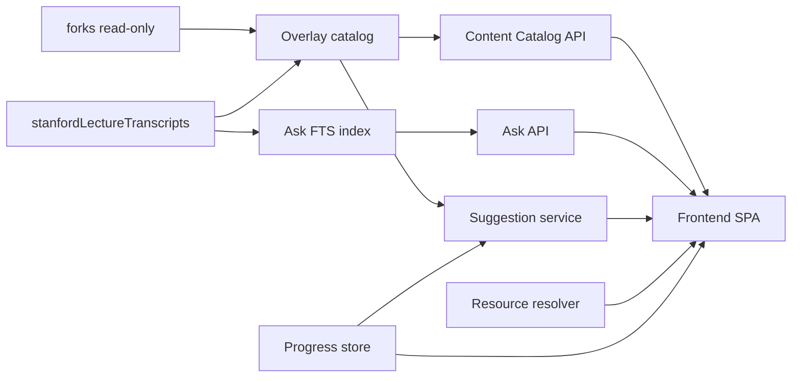

# Architecture

Backend and platform architecture for the progressive-applied learning product built on this learning pack. Stack-agnostic; recommended default is a thin catalog API plus a React/Next-style SPA.

Related: [CONTENT_CATALOG.md](CONTENT_CATALOG.md) · [FRONTEND_EXPERIENCE.md](FRONTEND_EXPERIENCE.md) · [AGENT_BUILDOUT.md](AGENT_BUILDOUT.md) · [ASK_CONVERSATIONAL_SEARCH.md](ASK_CONVERSATIONAL_SEARCH.md)

## Principles

1. **`forks/` is read-only content.** Never mutate upstream licenses, READMEs, or sources for product metadata.
2. **Overlay indexes own the product model.** Catalog, tracks, progress, and suggestion rules live under e.g. `data/catalog/` or `platform/` (paths TBD at implementation).
3. **Honesty about availability.** APIs and UI must distinguish local, link-only, and runtime-fetch resources.
4. **Rule-based suggestions first.** Level + progress + product area + filters for Learn/Build/Discover; Ask uses hybrid retrieval (FTS + dense) with optional LLM synthesis.
5. **Files first, DB later.** JSON/YAML catalog fixtures are acceptable until scale demands a store. Ask uses SQLite FTS5 under `data/ask/` for transcript chunks.
6. **Secrets stay local.** OpenAI keys live only in gitignored `.env` (never `NEXT_PUBLIC_*`, never client-supplied).

## Bounded contexts

| Context | Responsibility |
|---------|----------------|
| **Content Catalog** | Tracks, modules, filters, search over overlay index |
| **Ask / Lecture Retrieval** | Conversational query over Stanford transcripts; glossary; hybrid FTS+dense; optional LLM synthesis |
| **Progress / Identity** | Anonymous or signed-in progress; last module; completed set |
| **Suggestion / Recommendation** | `GET /suggestions` from progress + catalog graph |
| **External Resource Resolver** | Normalize external URLs, health/check optional, attribution |
| **Lab Runtime hints** | How to open a lab (path, commands, fetch URLs)—not full execution in v1 |
| **Ingest / Sync** | Re-vendor forks; regenerate catalog + Ask indexes (`platform/ingest/stanford/`) |



## Overlay layout (recommended)

```text
data/catalog/          # or platform/catalog/
  tracks.json
  modules.json
  stanford-tracks.json
  stanford-modules.json
data/ask/
  ask.sqlite           # FTS5 chunk index
  chunks.jsonl
  glossary.json
  courses.json
  embeddings.json      # optional; gitignored; regenerate via ingest
platform/web/.env      # local OPENAI_API_KEY (gitignored)
platform/web/.env.example
```

Do not write product fields into `forks/**` or mutate transcript HTML for metadata.

## Data model outline

### Catalog

- **Track**: see Content Catalog track schema.
- **Module**: see Content Catalog record schema.
- Indexes: by `product_area`, `level`, `skills`, `track_ids`, `offline_ok`.

### Progress (per learner)

```json
{
  "learner_id": "anon-or-user",
  "selected_level": "intermediate",
  "active_track_id": "de-zoomcamp",
  "completed_ids": ["dez-01-docker"],
  "last_module_id": "dez-01-docker",
  "offline_preference": false,
  "filters_by_area": {
    "learn": { "level": "intermediate", "modality": null }
  }
}
```

Sticky filters may live client-side only in v1; syncing `filters_by_area` is optional.

### Suggestion inputs

- `product_area` (optional focus)
- `selected_level`, `offline_preference`
- `last_module_id`, `completed_ids`, `active_track_id`
- Module fields: `next_ids`, `prerequisites`, `skills`, `track_ids`

## API surface (REST-shaped)

Base path example: `/api/v1`.

### Tracks and modules

| Method | Path | Purpose |
|--------|------|---------|
| `GET` | `/tracks` | List tracks (`product_area` optional query) |
| `GET` | `/tracks/{id}` | Track detail + ordered module summaries |
| `GET` | `/modules` | Filtered module list |
| `GET` | `/modules/{id}` | Full module record + resolved paths/URLs |

#### `GET /modules` query params

| Param | Description |
|-------|-------------|
| `product_area` | `learn` \| `build` \| `discover` \| `read` |
| `level` | Exact or “at or below” (document chosen semantics; recommend exact match + optional `level_max`) |
| `offline_ok` | `true` \| `false` |
| `skill` | Repeatable; AND or OR—document choice (recommend OR of skills) |
| `modality` | `lesson` \| `lab` \| `project` \| `reference` \| `reading` |
| `track_id` | Limit to one track |
| `availability` | `local` \| `link_only` \| `runtime_fetch` |
| `q` | Search title/summary/skills |
| `sort` | `recommended` \| `title` \| `duration` \| `updated` |
| `limit` / `cursor` | Pagination |

Default `sort=recommended` should return a **curated slice**, not the entire corpus.

### Suggestions

| Method | Path | Purpose |
|--------|------|---------|
| `GET` | `/suggestions` | 1–3 items with rationale |

Query params: `learner_id` (or session), `product_area`, `limit` (max 3).

Response shape:

```json
{
  "items": [
    {
      "module_id": "dez-02-orchestration",
      "reason": "Continues your Data Engineering Zoomcamp path",
      "kind": "next_lesson"
    }
  ]
}
```

`kind` examples: `next_lesson`, `related_lab`, `matching_dataset`, `matching_api`, `related_reading`.

### Progress

| Method | Path | Purpose |
|--------|------|---------|
| `GET` | `/progress` | Current progress |
| `POST` | `/progress/complete` | Body: `{ "module_id": "..." }` |
| `PUT` | `/progress/preferences` | Level, offline preference, active track |

### Resolve

| Method | Path | Purpose |
|--------|------|---------|
| `GET` | `/resolve/{module_id}` | Local path and/or `external_url`, attribution, `offline_ok` |

### Ask (Stanford lecture retrieval)

| Method | Path | Purpose |
|--------|------|---------|
| `POST` | `/ask` | Conversational query → structured answer (excerpts, definitions, lectures, apply, citations, evidence_strength, context) |
| `GET` | `/ask/lectures` | Browse/filter Stanford lecture modules |
| `GET` | `/transcripts/{id}` | Parsed transcript turns for a lecture |
| `GET` | `/glossary` | Term lookup from ingest glossary |

`POST /ask` accepts `history` and `context` for multi-turn rewrite. Hybrid retrieval uses full dense top-k + glossary FTS expansion; optional OpenAI embeddings/rerank/synthesis when `OPENAI_API_KEY` is set. Weak evidence skips synthesis and returns clarification. Clients never send API keys.

Eval: `python3 platform/ingest/stanford/eval_ask.py` (golden set in `data/ask/eval/queries.jsonl`).

## Suggestion algorithm (v1 rules)

Priority order (stop when `limit` reached):

1. If `active_track_id` and incomplete modules remain → next incomplete via track order or `next_ids`.
2. Else if `last_module_id` has unmet `next_ids` → those (respecting level / offline filters).
3. Else related `build` item sharing a `skill` with last completed `learn` module.
4. Else `discover` or `read` item sharing a skill/tag (only if network allowed or `offline_ok`).

Never return more than 3. Always include a one-line `reason`.

## Offline / online matrix

| Mode | Catalog | Local lessons/scripts | Link-only / APIs | Runtime-fetch labs |
|------|---------|----------------------|------------------|--------------------|
| Offline | Serve from overlay | Yes | Hide or badge + disable open | Show instructions; mark blocked without cache |
| Online | Same | Yes | Resolver opens external URL | Client/scripts fetch as documented in fork |

Future (out of scope for this doc pack): optional local dataset cache keyed by module id.

## Security and licensing

- Retain and surface per-fork `LICENSE` attribution on module/resource detail.
- Do not commit secrets (API keys for third-party APIs belong in user env / `platform/web/.env`, never in overlay).
- Treat `forks/` and `docs/stanfordLectureTranscripts/` paths as internal; do not require end users to know them (UI uses titles and product areas).
- Validate/sanitize any user-provided search input; do not execute arbitrary paths from client input when resolving files.

## Implementation notes for agents

- Start with static JSON + read-only HTTP handlers or a BFF in the SPA.
- Share OpenAPI or TypeScript types with frontend as the contract.
- Regenerating catalog from forks is an offline/CI job in Ingest/Sync—not a request-path crawl of `forks/`.
