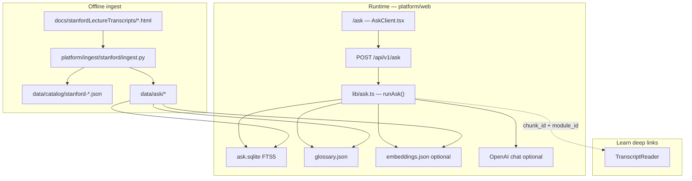
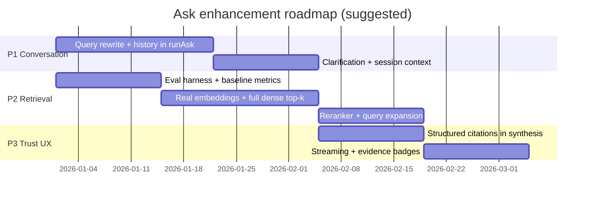

# Ask: Conversational Search Over Stanford Lectures

Technical reference for the **Ask the lectures** product area: how retrieval and answer generation work today, the data plane that powers them, and three prioritized enhancement tracks for a stronger conversational search experience.

Related: [ARCHITECTURE.md](ARCHITECTURE.md) · [FRONTEND_EXPERIENCE.md](FRONTEND_EXPERIENCE.md) · [CONTENT_CATALOG.md](CONTENT_CATALOG.md)

---

## 1. Product intent

Ask lets learners pose conceptual questions against open Stanford Engineering Everywhere lecture transcripts (9 courses, 205 lectures). The system is designed to:

- Return **grounded** answers tied to transcript evidence—not open-ended chat.
- Surface **structured context**: definitions, ranked excerpts, relevant lectures, related terms, and **Apply** links into Build/Discover.
- Work **offline** for retrieval (local SQLite + JSON indexes); optional **OpenAI synthesis** improves prose when `OPENAI_API_KEY` is configured server-side.
- Deep-link into **Learn** via `TranscriptReader`, scrolling to and highlighting the cited chunk.

Stanford lectures are cataloged as `product_area: "learn"` modules; Ask is a separate UI/API surface that queries the `data/ask/` index.

---

## 2. System overview



| Layer | Location | Role |
|-------|----------|------|
| **Source** | `docs/stanfordLectureTranscripts/` | Raw HTML/PDF lecture transcripts |
| **Ingest** | `platform/ingest/stanford/ingest.py` | Parse, chunk, index, glossary extraction |
| **Ask index** | `data/ask/` | SQLite FTS5, chunks JSONL, glossary, courses, embeddings |
| **Catalog overlay** | `data/catalog/stanford-modules.json`, `stanford-tracks.json` | Learn track/module metadata (merged at load) |
| **API** | `platform/web/src/app/api/v1/ask/route.ts` | `POST` handler → `runAsk()` |
| **UI** | `platform/web/src/components/AskClient.tsx` | Query form, course filters, structured results |
| **Reader** | `platform/web/src/components/TranscriptReader.tsx` | Lecture view + chunk highlight from Ask citations |

---

## 3. Ingest pipeline (index construction)

Regenerate all Ask assets from repo root:

```bash
python3 platform/ingest/stanford/ingest.py
```

### 3.1 HTML parsing

For each lecture file under `docs/stanfordLectureTranscripts/{courseFolder}/`:

1. **Decode** HTML (UTF-8 → cp1252 → latin-1 fallback).
2. **Extract title** from first non-empty stripped line; **duration** via `Duration: N minutes`.
3. **Split on speaker labels** using regex on bold tags (`<b>Speaker:</b>`).
4. **Classify role**: `instructor`, `student`, `audience`, `guest`, or `other` (heuristic on label text).
5. **Strip tags** and normalize whitespace into turn-level plain text.

### 3.2 Chunking strategy

Turns are merged into retrieval chunks in `chunk_turns()`:

| Parameter | Value | Purpose |
|-----------|-------|---------|
| `MAX_CHUNK_CHARS` | 2200 | Upper bound before flush |
| `MIN_CHUNK_CHARS` | 280 | Avoid tiny fragments |
| Long monologue split | Sentence boundaries | Keeps chunks within size limits |

**Weighting** (stored per chunk, used in fusion and dense scoring):

- Instructor turns: `weight = 1.0`
- Student / audience / guest: `weight = 0.55`
- `[inaudible]` penalty: `× 0.7`
- Logistics-heavy segments (homework, SCPD, exams): dropped when short and keyword-dense

Chunk IDs follow `{module_id}__c{idx:03d}` (e.g. `stanford-cs229-l01__c012`).

### 3.3 Glossary extraction

During ingest, regex patterns over instructor text capture definitional phrasing:

- “we define X as …”
- “X is a/an algorithm|method|model|…”
- “so-called X”

Entries are scored, deduped, stop-word filtered, and capped (~2500 terms) into `data/ask/glossary.json`. Each entry records `term`, `text` snippet, `chunk_id`, `module_id`, `course_id`, and `aliases`.

### 3.4 SQLite FTS5 index

`build_sqlite()` creates:

- **`chunks`** — relational store (chunk_id, module_id, course_id, lecture, speaker, role, weight, text).
- **`chunks_fts`** — FTS5 virtual table with **Porter stemmer** on `text`; metadata columns `UNINDEXED`.

BM25 ranking is used at query time via `bm25(chunks_fts)`.

### 3.5 Dense embeddings (optional)

`embeddings.json` maps `chunk_id → float[384]`. Vectors are produced by the same **feature-hash embedding** algorithm used at runtime (`featureHashEmbed`): MD5-token hashing into 384 dimensions with TF weighting and L2 normalization. This is a lightweight local substitute for a trained embedding model—not semantic embeddings from a transformer.

### 3.6 Catalog side effects

Ingest also writes/updates:

- `data/catalog/stanford-modules.json` — one module per lecture (`modality: "lesson"`, `offline_ok: true`, `source_path` to HTML).
- `data/catalog/stanford-tracks.json` — nine tracks (`stanford-cs106a` … `stanford-ee364b`).
- `data/ask/courses.json` — course metadata for Ask UI filter chips.

`lib/catalog.ts` merges Stanford modules/tracks with the main catalog at load time.

---

## 4. Query-time retrieval (`runAsk`)

Entry point: `platform/web/src/lib/ask.ts` → `runAsk({ query, course_ids?, history? })`.

### 4.1 Request contract

**Client** (`AskClient.tsx`) sends:

```json
{
  "query": "How does Andrew Ng introduce supervised learning?",
  "course_ids": ["cs229"],
  "history": [{ "role": "user", "content": "..." }, { "role": "assistant", "content": "..." }]
}
```

**Response** (`AskResponse`):

| Field | Description |
|-------|-------------|
| `answer` | Top-level prose (template or synthesized) |
| `definitions` | Up to 3 glossary hits |
| `excerpts` | Up to 5 ranked transcript chunks |
| `lectures` | Up to 5 deduped modules from top excerpts |
| `related_terms` | Glossary-derived follow-up chips |
| `apply` | Up to 2 Build/Discover suggestions by skill overlap |
| `mode` | `"retrieval"` \| `"synthesized"` |
| `llm_available` | Whether `OPENAI_API_KEY` is configured |
| `filters_applied` | Echo of `course_ids` |

**Note:** `history` is accepted by the API but **not yet consumed** in `runAsk()`—each request is effectively stateless on the server.

### 4.2 Hybrid retrieval

#### Stage A — FTS (keyword)

1. Tokenize query: `/[a-z0-9]+/g`, lowercased.
2. Build FTS query: up to 12 tokens as `"token" OR "token" …`.
3. SQL against `chunks_fts` with optional `course_id IN (...)` filter.
4. Order by `bm25(chunks_fts)`; fetch top **40** rows.

#### Stage B — Dense (semantic-ish)

1. Embed query with `featureHashEmbed(query)` (384-dim).
2. If `embeddings.json` exists:
   - Score cosine similarity × chunk `weight` for FTS candidates plus a **sparse global pass** (every 17th embedding key) for recall without full corpus scan.
3. Else:
   - Score cosine against hash-embeddings of FTS candidate texts only.
4. Keep top **40** dense hits.

#### Stage C — Reciprocal rank fusion (RRF)

Fuse FTS and dense lists with `k = 60`:

```
score(chunk) += (role_boost) / (k + rank_fts + 1)
score(chunk) += 1 / (k + rank_dense + 1)
```

`role_boost`: instructor **1.15**, non-instructor **0.85**.

Take top **8** fused chunks; hydrate full rows from `chunks` table. Excerpts truncate text at **1200** chars for the response payload.

### 4.3 Glossary pass

`glossaryHits(query)` scores glossary entries:

- +5 if query contains full term (case-insensitive)
- +3 if all term tokens appear in query tokens
- Partial token overlap: +0.75 per token

Returns up to 3 definitions above score threshold ≥ 3.

### 4.4 Lecture aggregation

From excerpt list, dedupe by `module_id` → `AskLectureHit` with catalog title and reason *“Contains a high-ranking excerpt for this question.”*

### 4.5 Apply suggestions

`applySuggestions(seedModule)` scans catalog modules in `build` and `discover` product areas:

- Skill overlap with seed lecture via `skillsOverlap()`.
- Course-aware skill preference (e.g. CS229 → `ml`, `scikit-learn`; CS106* → `algorithms`, `python`).
- Bonus for `stanford-applied` tag on build modules.
- Returns top 2 as `SuggestionItem` (`related_lab`, `matching_dataset`, `matching_api`).

### 4.6 Answer generation

Two modes:

| Mode | Trigger | Implementation |
|------|---------|----------------|
| **retrieval** | Default; or synthesis fails | `templateAnswer()` — stitches top excerpt (+ optional definition) into 2–3 sentences |
| **synthesized** | `OPENAI_API_KEY` set and `ASK_LLM_ENABLED` ≠ `"false"` | `synthesizeAnswer()` → OpenAI Chat Completions |

**Template answer** example structure:

> Most relevant context is from {lecture title} ({course} L{n}), where the instructor discusses: “{excerpt preview}…”  
> See cited excerpts below for full wording and lecture context.

**LLM synthesis** (`gpt-4o-mini` default, overridable via `OPENAI_MODEL`):

- System prompt: answer only from provided excerpts/definitions; cite chunk ids; 2–4 sentences; admit insufficient evidence.
- User message: question + up to 4 excerpts + definitions.
- API key is **server-only** (`platform/web/.env`); never sent from the browser.

### 4.7 Configuration

Copy `platform/web/.env.example` → `.env`:

```env
OPENAI_API_KEY=sk-...
OPENAI_MODEL=gpt-4o-mini
# ASK_LLM_ENABLED=false   # force retrieval-only even with key
```

Restart Next.js after changes.

---

## 5. UI and deep-linking

### 5.1 Ask page (`/ask`)

`AskClient` provides:

- Example question chips
- Course filter toggles (`course_ids`)
- Textarea + submit
- Results sections: Answer, Definitions, Conceptual excerpts, Relevant lectures, Related terms, Apply
- Mode badge (retrieval vs synthesized)

Client maintains local `history` array across turns but server ignores it today.

### 5.2 Citation → transcript

Excerpt links:

```
/learn/{track_id}/{module_id}?chunk={chunk_id}#{chunk_id}
```

`learn/[trackId]/[moduleId]/page.tsx` detects Stanford modules via `isStanfordModule()`, loads `loadTranscriptContent(moduleId, chunkId)`, and renders `TranscriptReader`.

`TranscriptReader` scrolls to `highlight_chunk_id` and applies CSS class `highlight` on the matching turn element.

### 5.3 Supporting API routes

| Method | Path | Purpose |
|--------|------|---------|
| `POST` | `/api/v1/ask` | Main conversational query |
| `GET` | `/api/v1/ask/lectures` | Browse Stanford lecture modules (`course_id`, `q` filters) |
| `GET` | `/api/v1/transcripts/{id}` | Full parsed transcript for a module |
| `GET` | `/api/v1/glossary` | Term lookup |

OpenAPI fragment: `platform/web/openapi.yaml`.

---

## 6. Operational characteristics

| Concern | Current behavior |
|---------|------------------|
| **Offline retrieval** | Yes — FTS + local embeddings file |
| **Offline synthesis** | No — requires OpenAI network |
| **Corpus size** | ~205 lectures; chunk count in `ask.sqlite` (ingest-dependent) |
| **Latency** | Dominated by FTS + embedding scan + optional OpenAI round-trip |
| **Caching** | In-process singletons: DB connection, glossary, courses, embeddings, chunk meta |
| **Security** | Path traversal guarded in catalog resolver; Ask reads fixed `data/ask/` paths only |

### Failure modes

- Empty FTS match (overly narrow query, Porter stemming mismatch) → template “No strong matches…”
- Missing `ask.sqlite` → 500 from API
- OpenAI errors → silent fallback to template answer (`mode: "retrieval"`)

---

## 7. Known limitations (as of current implementation)

1. **No conversational memory** — `history` is POSTed but not used for query rewriting or context carry-over.
2. **Hash embeddings, not semantic** — dense retrieval is approximate; synonyms and paraphrase miss without FTS overlap.
3. **Sparse dense scan** — when `embeddings.json` exists, only FTS seeds + every 17th global key are scored; true nearest-neighbor recall is incomplete.
4. **No cross-encoder rerank** — fusion order is RRF only; no second-stage relevance model.
5. **Template answers are excerpt-forward** — without LLM, the “answer” is often a quote lead-in, not a synthesized explanation.
6. **No streaming** — full response waits for retrieval + optional OpenAI.
7. **No explicit confidence / abstention UI** — weak matches are not surfaced distinctly from strong ones.
8. **Glossary is ingest-heuristic** — not curated; false positives possible on loose “X is a …” patterns.

---

## 8. Three recommended priority focus areas

These are ordered by impact on **conversational search quality** and alignment with the product’s grounded-learning mission.

### Priority 1 — Multi-turn conversation and query understanding

**Problem:** Follow-up questions (“What about the unsupervised case?”) lack lecture context because `history` is discarded server-side. Users experience Ask as repeated single-shot search, not a dialogue.

**Recommended work:**

| Item | Detail |
|------|--------|
| **Query rewriting** | Before retrieval, condense `history + query` into a standalone search query (small LLM call or heuristic last-N-turn merge). |
| **Server-side session** | Accept `session_id` or use signed cookie; store last excerpts/module ids for pronoun resolution. |
| **Clarifying questions** | When fused top score is below a threshold, return `needs_clarification` with suggested course or term disambiguation instead of a weak template answer. |
| **Related terms as threads** | Wire `related_terms` chips to preserve session context rather than isolated `Define {term}` queries. |

**Success metrics:** Follow-up recall@5 improves on a small eval set; user can complete a 3-turn conceptual thread without re-stating course names.

**Primary touchpoints:** `lib/ask.ts` (`runAsk`), `AskClient.tsx`, OpenAPI `history` schema, optional `docs/ask/eval-queries.jsonl` for regression.

---

### Priority 2 — Retrieval quality: embeddings, reranking, and eval harness

**Problem:** Feature-hash cosine + partial global scan limits semantic recall. Instructor-weighted RRF helps but cannot fix vocabulary mismatch (e.g. “SVM” vs “support vector machine” without FTS overlap).

**Recommended work:**

| Item | Detail |
|------|--------|
| **Real dense embeddings** | Extend ingest to emit `text-embedding-3-small` (or local `sentence-transformers`) vectors; store in SQLite `vec0` extension, flat file, or LanceDB. |
| **Full ANN or brute-force at scale** | 205 lectures × ~N chunks is small enough for exact top-k cosine in memory at startup; remove the “every 17th key” sampling shortcut. |
| **Cross-encoder rerank** | After fusion top-20, rerank with a lightweight cross-encoder (or LLM relevance grade) before excerpt selection. |
| **Query expansion** | Inject glossary aliases and course-specific synonyms into FTS (e.g. “dual problem” → “Lagrange dual”). |
| **Eval loop** | Curate 50–100 `(query, expected_course, expected_lecture)` pairs; CI script reports MRR/recall; block regressions on ingest changes. |

**Success metrics:** Recall@5 on eval set ≥ 0.8 for course-filtered queries; subjective review of top excerpt relevance improves on paraphrased questions.

**Primary touchpoints:** `platform/ingest/stanford/ingest.py`, `lib/ask.ts` (`denseCandidates`, `fuse`), new `platform/ingest/stanford/eval.py` or `scripts/ask-eval.sh`.

---

### Priority 3 — Grounded synthesis, citations, and trust UX

**Problem:** Template mode feels like search results, not answers. Synthesized mode exists but lacks inline citations, streaming, and explicit grounding guarantees in the UI.

**Recommended work:**

| Item | Detail |
|------|--------|
| **Structured synthesis schema** | Require JSON output: `{ answer, citations: [{ chunk_id, span }] }` with validation against retrieved set only. |
| **Inline citations in UI** | Render `[1]` footnotes in Answer linking to excerpt cards; highlight matching spans in `TranscriptReader`. |
| **Streaming responses** | SSE or `ReadableStream` from `/api/v1/ask` for answer token stream; excerpts/lectures sent first. |
| **Evidence strength indicator** | Show fused score band (strong / moderate / weak) and hide synthesis when top score < threshold. |
| **Abstention copy** | Standard empty state: suggest course filter, glossary term, or Browse lectures — per FRONTEND_EXPERIENCE empty-state rules. |

**Success metrics:** Citation click-through rate; reduced “hallucination” reports in manual review; time-to-first-token < 1s with streaming.

**Primary touchpoints:** `synthesizeAnswer()`, `AskClient.tsx`, `TranscriptReader.tsx`, `FRONTEND_EXPERIENCE.md` § Ask patterns.

---

## 9. Suggested implementation sequence



P2 eval harness should land **before** large retrieval refactors so improvements are measurable. P1 and P2 can proceed in parallel if different owners; P3 synthesis UX depends on stable excerpt ranking from P2.

---

## 10. Quick reference

```bash
# Run platform
cd platform/web && npm install && npm run dev

# Regenerate Ask index
python3 platform/ingest/stanford/ingest.py

# Optional synthesis
cp platform/web/.env.example platform/web/.env
# set OPENAI_API_KEY=...

# Manual API test
curl -s -X POST http://localhost:3000/api/v1/ask \
  -H 'Content-Type: application/json' \
  -d '{"query":"What is the dual of a convex optimization problem?","course_ids":["ee364a"]}' \
  | python3 -m json.tool
```

| Artifact | Path |
|----------|------|
| Retrieval logic | `platform/web/src/lib/ask.ts` |
| Ask UI | `platform/web/src/components/AskClient.tsx` |
| Ingest | `platform/ingest/stanford/ingest.py` |
| FTS database | `data/ask/ask.sqlite` |
| Transcript reader | `platform/web/src/components/TranscriptReader.tsx` |
