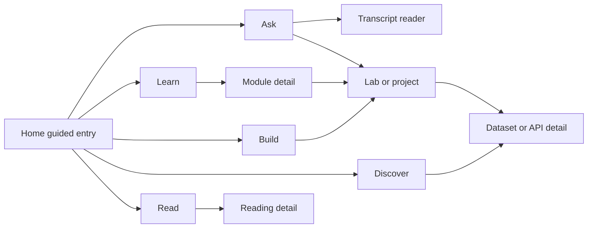

# Frontend Experience

**UX source of truth** for a sleek, high-usability, responsive, polished **minimalist** learning platform. Frontend agents implement against this document; backend contracts live in [ARCHITECTURE.md](ARCHITECTURE.md); content shape in [CONTENT_CATALOG.md](CONTENT_CATALOG.md).

## 1. North star

- Users of all levels explore instructive modules and applied experiences **without** navigating raw multi-repo trees.
- The UI feels calm, fast, and curated: generous whitespace, clear hierarchy, one primary action per view, minimal chrome.
- Guidance is always available (suggestions, “what next,” contextual help) without feeling noisy or gamified.
- Product areas—not `forks/` paths—are the navigation model.

## 2. Design system (requirements, not shipped CSS)

### Visual language

- Minimalist; restrained palette via CSS variables (`--bg`, `--surface`, `--text`, `--text-muted`, `--accent`, `--border`).
- Expressive but purposeful typography (avoid default Inter/Roboto/system-only stacks when building the product UI).
- Avoid purple-on-white / purple–indigo gradient “AI default” looks, heavy multi-layer shadows, and glow effects.
- Prefer lists and structured sections over dense card grids; use cards only for discrete choices/actions.

### Motion

Ship 2–3 intentional transitions only:

1. Route / view change (subtle fade or short slide).
2. Dropdown / sheet open-close.
3. Suggestion rail appear / update.

No decorative ambient motion.

### Density and layout

- One job per section; one headline + short supporting line where copy is needed.
- Home is a single composition—not a dashboard (no stats strips, schedule widgets, or promo clusters).
- Quiet metadata (level, offline badges) secondary to title and primary CTA.

### Responsive

- Mobile-first breakpoints; collapsible nav.
- Touch-friendly controls (adequate hit targets).
- Desktop dropdowns → **bottom sheets** or full-screen filter panels on small viewports (`MobileFilterSheet`).

### Accessibility

- Keyboard-complete dropdowns and comboboxes (arrow keys, Enter, Escape).
- Visible focus rings; ARIA roles for menus, listboxes, tabs, dialogs/sheets.
- Contrast-safe text; skip link to main content.
- Do not rely on color alone for offline vs network status.

## 3. Information architecture

### Global shell

- Compact top or side nav: Ask / Learn / Build / Discover / Read.
- Persistent **Continue** and entry to **Suggested** (rail or panel).
- Global search combobox (catalog) plus dedicated **Ask** conversational surface.
- Level control available from shell or sticky filter bar.

### Home

- Brand / product name as hero-level signal.
- One headline, one short supporting sentence.
- Primary CTA: **Ask a question**.
- Secondary CTA: **Continue** (if progress exists) or **Start a path**.
- Optional compact SuggestionRail (≤3)—no stats or secondary marketing blocks.

### Detail views

- Breadcrumbs + clear back affordance.
- Primary CTA above the fold (Open lesson / Open lab / Open resource).

## 4. Guided suggestions

### Onboarding path picker

Short dropdown or segmented control:

> I am new to… Python / R / data engineering / production ML

Maps to track ids (`python-ds`, `r-ds`, `de-zoomcamp`, `applied-ml-reading`). Routes into the matching track’s Recommended slice.

### Suggested for you

- Cap at **1–3** items.
- Each item: title + one-line **why** (“Continues your DE Week 1 path”).
- Kinds: next lesson, related lab, matching dataset/API, related reading.
- Never unexplained recommendations.

### What next (module completion)

- Primary: continue next module in track.
- Optional secondary: one Discover or Read item sharing a skill.
- Single panel (`WhatNextPanel`)—not a modal maze.

### Empty / stuck states

Gentle, actionable copy:

- “Try lowering the level filter.”
- “Switch to offline-available modules.”
- “Clear filters to see recommended picks.”

### Ranking inputs (client + API)

Current product area, selected level, last completed module, `offline_ok` preference. Rule-based; see Architecture.

## 5. Dropdowns, filters, and navigational controls

| Control | Role |
|---------|------|
| Level dropdown / select | Beginner → Production; filters lists |
| Product-area switcher | Learn / Build / Discover / Read |
| Track dropdown | Progressive track within Learn/Build |
| Skill / tag filter | Multi-select chips or dropdown |
| Availability filter | Offline / Needs network / Any |
| Modality filter | Lesson / Lab / Project / Reading / Reference |
| Sort dropdown | Recommended, A–Z, Duration, Recently updated |
| Global search combobox | Fuzzy title/skill search; keyboard nav; recent queries |
| Module TOC dropdown | Jump within long lessons |
| Discover category dropdown | Domain topics from catalog indexes |

### Behavior rules

- Filters are **sticky per product area** (session or `localStorage`) and shown as removable chips (`FilterChip`).
- Default list state: curated **Recommended**, not entire corpus.
- One primary filter row; advanced filters behind a single **Filters** disclosure.
- Accessible combobox/listbox patterns; mobile uses sheet/stacked panel.
- Do not present a multi-column filter sidebar on first paint.

## 6. Per-product-area patterns

### Learn

- Sequential module list with progress ticks (`ModuleList` / `ModuleRow`).
- Level badge + prerequisite hint as quiet metadata.
- Open → `LessonReader` (notebook/markdown) or `TranscriptReader` (Stanford HTML lectures).
- TOC dropdown for long modules; transcript highlight when arriving from Ask citations.

### Ask

- Conversational composer with course filter chips and example queries.
- Structured results: answer (with citation footnotes), definitions, excerpts (lecture deep-links), relevant lectures, related terms, Apply (Build/Discover).
- Quiet mode badge: retrieval-only vs synthesized (OpenAI via server `.env`).
- Quiet **evidence** badge (`strong` / `moderate` / `weak`); weak matches show clarification (course chips / Browse Learn) instead of misleading excerpts.
- Multi-turn: client sends `history` + last `context`; related-term chips preserve course filters and session context.
- Never collect API keys in the UI.

### Build

- Lab/project rows or choice cards with time estimate and offline/fetch badges.
- Clear **Open lab** CTA (`LabLauncher`) showing path/commands/hints—not a fake IDE in v1.
- Link “needs network” when runtime-fetch is required.
- `stanford-applied` track mirrors CS229/CS106 themes for Explain-then-Build flows.

### Discover

- Dual browse: **Datasets** | **APIs**.
- Category dropdown + search.
- `ResourceDetail`: attribution, license note, open-external, **needs network** badge.
- Optional **Use in a lab** suggestion → Build.

### Read

- Topic-grouped lightweight lists from applied-ml-style readings.
- Open external with clear network expectation.
- Related Learn/Build suggestions (one line each).

### Cross-linking

Light touch only (e.g. after a Pandas lesson → one practice script + one dataset). Never force multi-area sprawl on one screen.

## 7. Progressive disclosure and polish states

- Level / prerequisite / offline badges: quiet, not hero chrome.
- Loading skeletons for list and detail.
- Optimistic update on Continue / complete.
- Broken external link: error + retry + “find similar” suggestion.
- First-run coach marks: dismissible, **max 2–3**, only for path picker and filters.

## 8. Component inventory

### Shell

`AppNav`, `ProductAreaTabs`, `SuggestionRail`, `ContinueBanner`, `GlobalSearchCombobox`, `FilterBar`, `FilterChip`, `LevelSelect`, `TrackSelect`, `SortSelect`, `MobileFilterSheet`, `AskClient`

### Content

`HomeHero`, `TrackList`, `ModuleList`, `ModuleRow`, `LessonReader`, `TranscriptReader`, `LabLauncher`, `ResourceDetail`, `ReadingList`, `ProgressRail`, `ResourceBadge`, `EmptyState`, `WhatNextPanel`

### Interaction notes (all groups)

| State | Expectation |
|-------|-------------|
| Keyboard | Full operate without pointer for nav, filters, search, suggestions |
| Loading | Skeletons; no layout jump |
| Empty | `EmptyState` with one recovery action |
| Error | Plain language + retry; no raw stack traces |

## 9. Anti-patterns

- Raw `forks/` file tree as primary navigation.
- Dashboard-of-everything home (stats, schedules, multi-promo clutter).
- Dense multi-column filter sidebars on first paint.
- Suggestion spam (>3 items or unexplained recommendations).
- Card-only layouts where a simple list would scan faster.
- Exposing repo-relative paths as the main user-facing label (internal detail only).

## 10. FE agent checklist

- [ ] Product-area nav works end-to-end with fixture or live API
- [ ] Home matches single-composition rules
- [ ] Filters sticky per area; chips removable
- [ ] Dropdowns/sheets keyboard accessible
- [ ] SuggestionRail ≤3 with rationale copy
- [ ] Offline / needs-network badges consistent
- [ ] Responsive: mobile sheet filters verified
- [ ] No end-user dependency on browsing `forks/` paths
