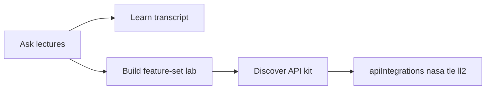

# Stanford Earth & Space Feature Sets

How live APIs under [`docs/apiIntegrations/`](apiIntegrations/) demonstrate concepts from [`docs/stanfordLectureTranscripts/`](stanfordLectureTranscripts/).

Related: [ASK_CONVERSATIONAL_SEARCH.md](ASK_CONVERSATIONAL_SEARCH.md) · [CONTENT_CATALOG.md](CONTENT_CATALOG.md) · [FRONTEND_EXPERIENCE.md](FRONTEND_EXPERIENCE.md)

## Loop

1. **Ask** a lecture-grounded question (course filter optional).
2. Open the **cited transcript** in Learn (`TranscriptReader`).
3. **Apply** → a Build lab on track `stanford-earth-space` (feature set aligned to the course). Apply links resolve the build track from the module (`ses-*` → `stanford-earth-space`), not the python-practice default.
4. **Discover** cards for EONET / TLE / Launch Library 2 point at the apiIntegrations kits and in-app kit pages.



## Web surfaces

| Route | Purpose |
|-------|---------|
| `/build/stanford-earth-space` | Labs grouped by FS1–FS5 |
| `/build/stanford-earth-space/sets/{setId}` | Feature-set hub (principles, APIs, ordered steps) |
| `/discover/kits/nasa` \| `tle` \| `launch-library` | Thin kit pages → Discover modules + feature sets |
| `/discover/apis?tag=eonet` (also `tle`, `launch-library`) | Tag filter on APIs |

Catalog: [`data/catalog/feature-sets.json`](../data/catalog/feature-sets.json) is loaded at runtime via `loadFeatureSets()`.

## API kits

| Kit | Path | In-app | Feature sets |
|-----|------|--------|----------------|
| NASA EONET | [apiIntegrations/nasa/](apiIntegrations/nasa/) | `/discover/kits/nasa` | FS1, FS4, FS5 |
| TLE | [apiIntegrations/tle/](apiIntegrations/tle/) | `/discover/kits/tle` | FS2, FS5 |
| Launch Library 2 | [apiIntegrations/launch-library/](apiIntegrations/launch-library/) | `/discover/kits/launch-library` | FS3, FS5 |

## Feature sets

| ID | Title | Courses | Principles | Lab folder | Primary endpoints used |
|----|-------|---------|------------|------------|------------------------|
| FS1 | Events, Features & Labels | CS229, CS106 | Features, labels, acquisition | `fs1_events_labels/` | EONET `/categories`, `/events`, `/events/geojson`, `/layers/wildfires`, bbox `/events` |
| FS2 | State, Dynamics & Tracking | EE263, CS223A | State trajectories, tracking | `fs2_state_tracking/` | TLE `/?search=`, `/{norad}`, `/{norad}/propagate` (+ velocity); EONET bbox overlay |
| FS3 | Scheduling & Constraints | EE364, CS106 | Windows, ranking | `fs3_schedule_constraints/` | LL2 `/config/launchstatus/`, `/agencies/?featured=true`, `/pad/`, `/launch/upcoming/` (+ `lsp__id` / `status`) |
| FS4 | Signals from Magnitudes | EE261, CS229 | 1-D signals, event rate | `fs4_signals_magnitudes/` | EONET `/magnitudes`, `/events` with `magID`/`magMin` (quakes + storms) |
| FS5 | Earth–Space Capstone | CS229+EE263+CS223A | Multi-source fusion | `fs5_capstone/` | Composes `out/` from FS1–FS4 when present; else live EONET + LL2 + TLE |

Shared client: `platform/labs/stanford-earth-space/_common.py` (`get_json` validates status, JSON decode, optional `expect_keys`).

## Run labs

```bash
cd platform/labs/stanford-earth-space
python3 -m venv .venv && source .venv/bin/activate
pip install -r requirements.txt
python fs1_events_labels/01_fetch_open_events.py
```

Network required. Outputs → `out/` (gitignored). FS5 prefers prior `out/` artifacts over re-fetching.

## Refresh apiIntegrations snapshots

Manual only (not request-path). Re-`curl` endpoints listed in each folder’s `*Links.md` when upstream schemas change.
