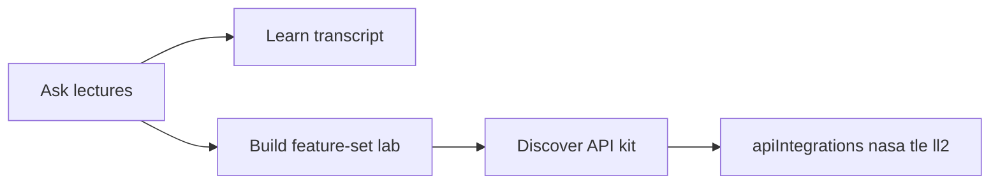

# Stanford Earth & Space Feature Sets

How live APIs under [`docs/apiIntegrations/`](apiIntegrations/) demonstrate concepts from [`docs/stanfordLectureTranscripts/`](stanfordLectureTranscripts/).

Related: [ASK_CONVERSATIONAL_SEARCH.md](ASK_CONVERSATIONAL_SEARCH.md) · [CONTENT_CATALOG.md](CONTENT_CATALOG.md) · [FRONTEND_EXPERIENCE.md](FRONTEND_EXPERIENCE.md)

## Loop

1. **Ask** a lecture-grounded question (course filter optional).
2. Open the **cited transcript** in Learn (`TranscriptReader`).
3. **Apply** → a Build lab on track `stanford-earth-space` (feature set aligned to the course).
4. **Discover** cards for EONET / TLE / Launch Library 2 point at the apiIntegrations kits.



## API kits

| Kit | Path | Feature sets |
|-----|------|----------------|
| NASA EONET | [apiIntegrations/nasa/](apiIntegrations/nasa/) | FS1, FS4, FS5 |
| TLE | [apiIntegrations/tle/](apiIntegrations/tle/) | FS2, FS5 |
| Launch Library 2 | [apiIntegrations/launch-library/](apiIntegrations/launch-library/) | FS1 labels, FS3, FS5 |

## Feature sets

| ID | Title | Courses | Principles | Lab folder |
|----|-------|---------|------------|------------|
| FS1 | Events, Features & Labels | CS229, CS106 | Features, labels, acquisition | `platform/labs/stanford-earth-space/fs1_events_labels/` |
| FS2 | State, Dynamics & Tracking | EE263, CS223A | State trajectories, tracking | `…/fs2_state_tracking/` |
| FS3 | Scheduling & Constraints | EE364, CS106 | Windows, ranking | `…/fs3_schedule_constraints/` |
| FS4 | Signals from Magnitudes | EE261, CS229 | 1-D signals, event rate | `…/fs4_signals_magnitudes/` |
| FS5 | Earth–Space Capstone | CS229+EE263+CS223A | Multi-source fusion | `…/fs5_capstone/` |

Catalog metadata: [`data/catalog/feature-sets.json`](../data/catalog/feature-sets.json). Build track: `stanford-earth-space`.

## Run labs

```bash
cd platform/labs/stanford-earth-space
python3 -m venv .venv && source .venv/bin/activate
pip install -r requirements.txt
python fs1_events_labels/01_fetch_open_events.py
```

Network required. Outputs → `out/` (gitignored).

## Refresh apiIntegrations snapshots

Manual only (not request-path). Re-`curl` endpoints listed in each folder’s `*Links.md` when upstream schemas change.
