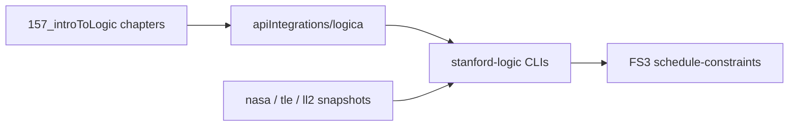

# Stanford Introduction to Logic (Intrologic) + Logica

How CS157 / [Introduction to Logic](http://intrologic.stanford.edu/public/lessons.php)
fits the platform loop, and how Logica-inspired tools reuse Earth–Space API kits.

## Content

| Asset | Path |
|-------|------|
| Lesson mirror (17 chapters + exercises) | [stanfordLectureTranscripts/157_introToLogic/](stanfordLectureTranscripts/157_introToLogic/) |
| Index | [157_introToLogic/INDEX.md](stanfordLectureTranscripts/157_introToLogic/INDEX.md) |
| Refresh fetcher | `python3 platform/ingest/stanford/fetch_intrologic.py` |

Attribution: Tools for Thought / Michael Genesereth — educational mirror only.

## Ask → Learn → Build → Discover

1. **Learn** — Read mirrored chapters under `157_introToLogic/chapters/` (or upstream Intrologic).
2. **Discover** — Open `/discover/kits/logica` for tool links and kit docs.
3. **Build** — Run `platform/labs/stanford-logic/` (Babbage, Quine, Stickel, Russell, Wegman).
4. **Apply with APIs** — Russell lab encodes Launch Library statuses, EONET categories, and TLE collection facts as propositional constraints (same surface as FS3).

Ask indexing of Intrologic markdown is deferred (SEE HTML ingest only today).

## Kits

| Kit | Role |
|-----|------|
| [apiIntegrations/logica/](apiIntegrations/logica/) | Tool map, worlds, constraints |
| [apiIntegrations/nasa/](apiIntegrations/nasa/) | Event/source facts → atoms |
| [apiIntegrations/tle/](apiIntegrations/tle/) | Satellite presence → atoms |
| [apiIntegrations/launch-library/](apiIntegrations/launch-library/) | Status table → atoms |

## Feature set bridge

FS3 **schedule-constraints** lists `papi-logic-logica` alongside Launch Library so the Build feature-set hub links the Logica kit next to launch-window labs.
